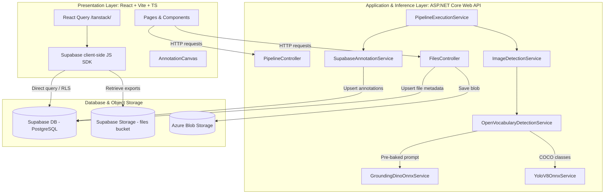
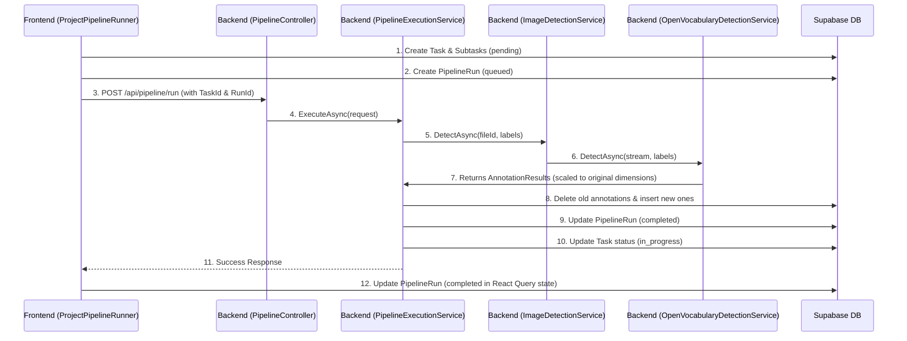
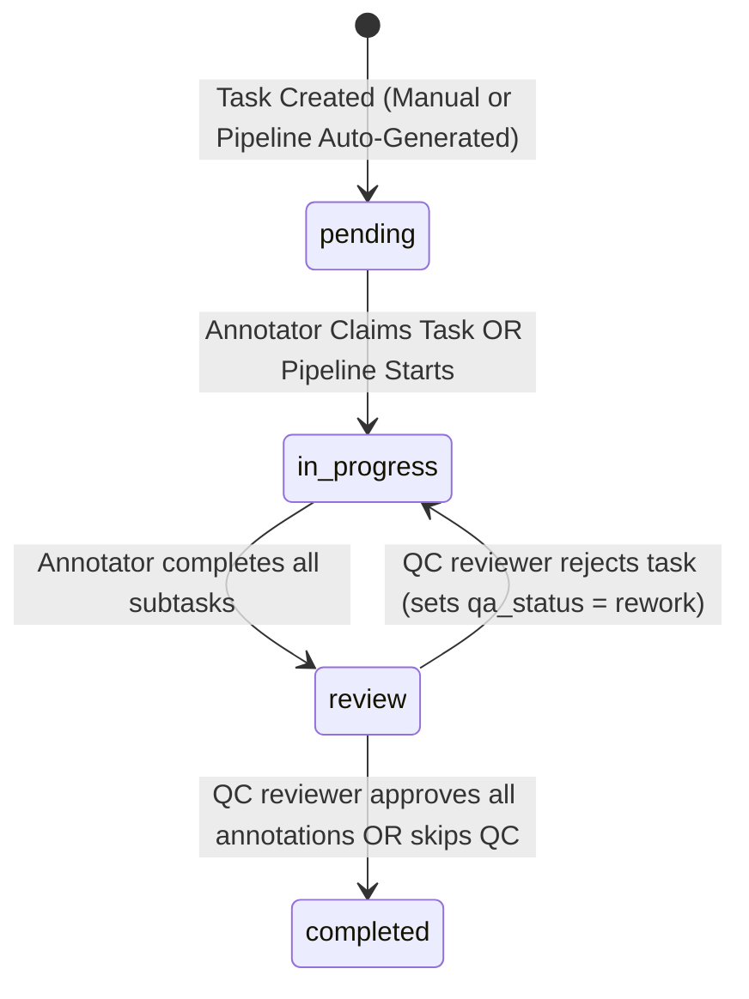
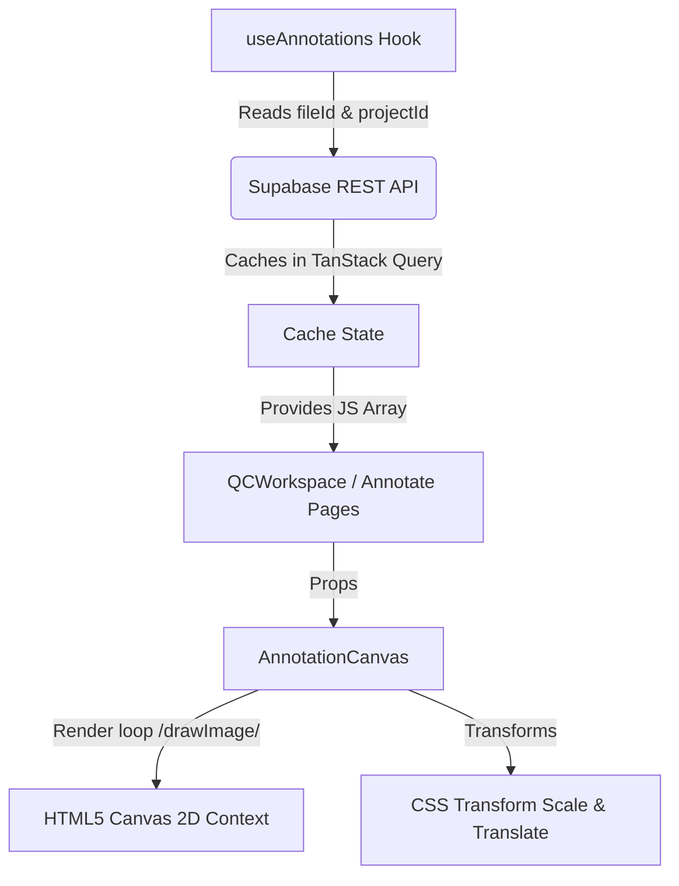
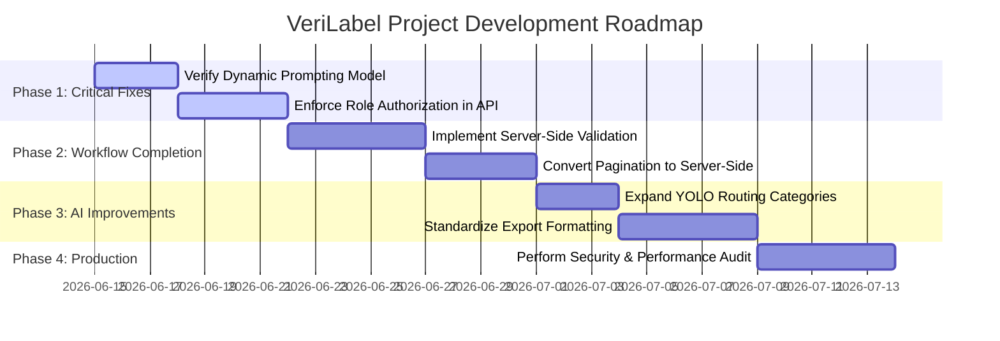

# VERILABEL SYSTEM AUDIT
**Date:** June 15, 2026  
**Status:** Audit Complete (No code modifications, inspection only)  
**Workspace:** `/Users/deepak/Desktop/veri-label-dev`

---

## 1. System Architecture Overview

The VeriLabel system is built using a modern, multi-tiered architecture that separates the presentation layer, application logic, database, and machine learning inference components.



### Frontend Architecture
* **Core Technologies:** React 18, Vite, TypeScript, Tailwind CSS, shadcn/ui components.
* **State Management & Data Fetching:** TanStack Query (`@tanstack/react-query`) is used for query caching, cache invalidation, and asynchronous mutations.
* **Routing:** Client-side routing is handled via `react-router-dom`.
* **Database Client:** Client-side interaction with PostgreSQL uses the `@supabase/supabase-js` library.
* **Pages:**
  - `Auth.tsx` (User sign-in/sign-up page)
  - `Dashboard.tsx` (Overall system/project metrics dashboard)
  - `Projects.tsx` (Lists, edits, clones, or deletes projects)
  - `ProjectDetail.tsx` (Tabbed project details: guidelines, labels/ontology definitions, files, pipeline runs)
  - `Tasks.tsx` (Organizes tasks across Annotation, QC, and Completed states)
  - `PerformTask.tsx` (Main workspace containing task annotations and QC review)
  - `Annotate.tsx` (Alternative ad-hoc file annotator)
  - `Exports.tsx` (Configures and downloads dataset exports)
  - `Team.tsx` (Invites and manages organization team members)
  - `Settings.tsx` (Configures workspace and organization parameters)

### Backend Architecture
* **Core Technologies:** .NET 8, ASP.NET Core Web API, C#.
* **Authentication:** Authenticates incoming requests via JWT tokens issued by Supabase (`JwtBearerDefaults` handler mapped to `supabaseUrl/auth/v1`).
* **Controllers:**
  - `PipelineController`: Exposes the endpoint `/api/pipeline/run` to execute auto-tagging pipelines.
  - `FilesController`: Handles file uploads (saving to Azure and Supabase), fetches secure SAS URLs, and deletes files.
  - `DatasetManagementController`: Manages dataset structures and files.
  - `InvitationsController`, `OrganizationsController`, `TeamController`: Manage administration workflows.
* **Services:**
  - `PipelineExecutionService`: Runs node configurations (inputs, AI detections, filters) and persists results.
  - `ImageDetectionService`: Downloads images from storage and coordinates detectors.
  - `OpenVocabularyDetectionService`: Evaluates project labels and routes them to YOLO or GroundingDINO.
  - `GroundingDinoOnnxService` & `YoloV8OnnxService` (defined in `YoloWorldDetectionService.cs`): Perform ONNX inference.
  - `SupabaseAnnotationService`: Fetches project label ontology schemas, resets existing annotations, and bulk-inserts new annotations.
  - `AzureBlobStorageService`: Connects directly to Azure Blob Storage containers, saves streams, and generates time-bounded SAS read URLs.

### Database Architecture
* **Database System:** Supabase PostgreSQL.
* **Access Layer:** The backend communicates with Supabase via HTTP REST client endpoints utilizing user JWT tokens for RLS validation. The frontend uses the direct Supabase JS SDK.
* **Security:** Row Level Security (RLS) is enabled on major tables. Policies are written to restrict queries to organization owners, managers, or assigned annotators/QC members.

### AI Architecture
* **Inference Library:** Microsoft.ML.OnnxRuntime.
* **Execution Environment:** CPUs or GPUs mapped through standard ONNX Execution Providers.
* **Inference Models:**
  - YOLOv8s (`yolov8s.onnx`): Pre-trained on 80 COCO classes, input shape `[1, 3, 640, 640]`, output shape `[1, 84, 8400]`.
  - GroundingDINO (`groundingdino_test.onnx`): Input shape `[1, 3, 800, 1200]`, outputs `pred_logits` shape `[1, 900, 256]` and `pred_boxes` shape `[1, 900, 4]`.

---

## 2. Annotation Flow Audit

The diagram below maps the complete lifecycle of a file annotation, tracing how it transitions from project setup to data export:

```
[Project Creation] ──> [Upload File] ──> [Create Task] ──> [Run Pipeline] ──> [AI Detection]
                                                                                   │
[Export Data] <── [QC Review] <── [Perform Task (Manual)] <── [Save Annotation] <──┘
```

Detailed tracing of each step in the lifecycle:

| Step | Component / Location | Method / Class | Purpose | Inputs | Outputs |
| :--- | :--- | :--- | :--- | :--- | :--- |
| **1. Project Creation** | Frontend: `Projects.tsx` | `handleCreate` / `useProjects` mutation | Creates a new annotation project with specified data type, annotation type, and guidelines. | Project metadata (name, description, dataType, guidelines) | Supabase `projects` row |
| **2. Upload File** | Frontend: `ProjectDetail.tsx`<br>Backend: `FilesController.cs` | `handleFilesSelected`<br>`Upload` / `FilesController` | Uploads file to Azure, registers local DB metadata, and inserts a file record into Supabase. | Multipart Form (file stream, projectId, folder, optional text content) | File metadata + SAS URL |
| **3. Create Task** | Frontend: `ProjectPipelineRunner.tsx`<br>Frontend: `Tasks.tsx` | `handleRun`<br>`useTasks:createTask` mutation | Creates a task and task subtask associations linking files to be annotated. | Project ID, task name, selected file IDs | `tasks` & `sub_tasks` rows |
| **4. Run Pipeline** | Frontend: `ProjectPipelineRunner.tsx`<br>Backend: `PipelineController.cs` | `handleRun`<br>`Run` / `PipelineController` | Serializes configuration/labels and triggers the backend pipeline API execution. | Pipeline Payload (TaskId, ProjectId, FileIds, Labels, SelectedLabel) | Execution result JSON |
| **5. AI Detection** | Backend: `OpenVocabularyDetectionService.cs` | `DetectAsync` / `OpenVocabularyDetectionService` | Resolves labels to run YOLOv8 (for COCO classes) or GroundingDINO (zero-shot text-prompting). | Image stream, list of labels, model config thresholds | List of `AnnotationResult` |
| **6. Save Annotation** | Backend: `SupabaseAnnotationService.cs` | `SaveAnnotationsAsync` / `SupabaseAnnotationService` | Flushes existing auto-annotations on selected files and inserts the new bounding box coordinates. | User JWT, FileId, ProjectId, UserId, annotations list | Count of inserted annotations |
| **7. Perform Task** | Frontend: `PerformTask.tsx` / `AnnotationCanvas.tsx` | `handleAnnotationCreate` / `handleMarkComplete` | Allows annotator to modify bounding boxes on the canvas and submit the task to the QC pool. | UI drawing events (mouse dragging, label assignments) | Updated `annotations` & task status `review` |
| **8. QC Review** | Frontend: `QCWorkspace.tsx` | `handleAccept` / `handleRework` | Allows QC reviewer to inspect annotations and approve them or send them back to the annotator for rework. | QC selection clicks, text comments | `qc_status` updates in DB, task status shifts |
| **9. Export** | Frontend: `Exports.tsx` | `handleNewExport` / `useExports` mutation | Downloads annotations for a project or task, formats them as JSON/CSV, and saves to storage. | Project ID, Task ID, export format | Downloadable URL |

---

## 3. Pipeline Audit

### Pipeline Execution Flow
The pipeline runs through a series of logical phases spanning frontend triggers and backend services:



### Node Execution Flow
In `PipelineExecutionService.ExecuteAsync`, the service loops through the array `request.Nodes` matching block configurations:
1. **Node: Input / IO:** Status set to `"Executed"` without computation.
2. **Node: AI:** Triggers `ImageDetectionService.DetectAsync`.
3. **Ontology filtering:** Detections are filtered by `request.SelectedLabel` if set (case-insensitive string checks).
4. **Saving annotations:** `SupabaseAnnotationService.SaveAnnotationsAsync` is called with target coordinates.
5. **Run Completion:** If successful, status changes to `"completed"`. If no annotations are detected, it updates to `"completed_with_no_annotations"`.
6. **Task Transition:** Updates the task status to `"in_progress"`.

### Parameter Propagation Verification
* **`TaskId`:** Generated on the frontend in `ProjectPipelineRunner.tsx` and passed in the payload. Backend resolves it and calls `UpdateTaskStatusAsync` to set status to `"in_progress"`. *Note: The `annotations` table does not store a task ID; task linkages are maintained via the `sub_tasks` junction table.*
* **`ProjectId`:** Resolved as `Guid projectId` in `PipelineExecutionService.cs` and propagated to `SaveAnnotationsAsync` for database insertion.
* **`FileId` / `FileIds`:** Resolved as a list of UUIDs. The pipeline loops through each `fileId`, downloading the stream via `ImageFileResolverService` and saving annotations mapped to `file_id`.
* **`SubtaskId`:** Optional parameter passed if running on a single file within a task. If present, the backend updates the specific subtask's status to `"review"`.
* **`RunId`:** Mapped to the `pipeline_runs` table. Used to track execution progress on the Pipeline Runs dashboard.

---

## 4. Task System Audit

### Task Lifecycle State Diagram

The task system transitions through four main states, including a loop back to the annotator if the QC check fails:



* **`pending`:** Initial state of task creation. No annotations are finalized.
* **`in_progress`:** Annotator is editing labels. Subtask states can be `pending`, `in_progress`, or `completed`.
* **`review`:** All subtask states are marked `"completed"`. The task is queued in the QC Review Pool for verification.
* **`completed`:** Task is locked and marked as successfully annotated.

### Database Columns Usage
* **`assigned_to`:** UUID of the annotator. Checked in `Tasks.tsx` to filter tasks for standard users. Check is bypassed for Managers and Admins.
* **`qa_assigned_to`:** UUID of the assigned QC reviewer.
* **`status`:** Core task state (`pending` \| `in_progress` \| `review` \| `completed`).
* **`qa_status`:** Quality assurance evaluation (`pending` \| `rework` \| `completed` \| null).

---

## 5. QC Workflow Audit

The QC workflow is fully integrated into the task execution page but activates a specialized workspace in review mode:

1. **Submission:** When an annotator marks all subtasks as complete, the task status becomes `review` and `qa_status` becomes `pending`.
2. **Assignment:** Managers can assign a reviewer via `QAAssignDialog` (setting `qa_assigned_to` and `qa_status = "pending"`). Alternatively, a QC member can claim a task by updating `qa_assigned_to` and `qa_status` directly.
3. **QC Review Mode:** Opening a task in review mode (`PerformTask.tsx?mode=qc`) swaps the regular editor for `QCWorkspace.tsx`.
4. **Item Verification:** For each annotation, the reviewer clicks:
   * **Approve:** Sets `qc_status` in database to `"approved"`.
   * **Rework:** Prompts for a comment and sets `qc_status` to `"rework"`.
5. **Rectification:** QC members can also select "Rectify" to edit the annotation coordinates/labels directly on the canvas and mark it approved.
6. **Task Completion:**
   * **If Rework exists:** If any annotations are marked `"rework"`, completing the QC workspace resets all task subtasks back to `"pending"`, shifts task status to `"in_progress"`, and sets `qa_status` to `"rework"`.
   * **If Clean:** If all annotations are approved, task status is updated to `"completed"` and `qa_status` is updated to `"completed"`.

---

## 6. Annotation Rendering Audit

### Technical Implementation



### Analysis of Drawing & Coordinate Math
* **Annotation Loading & Saving:** Loaded through `useAnnotations.ts` using TanStack Query, querying annotations matching `file_id` and `project_id`. Manual annotations are inserted via standard Supabase JS SDK calls.
* **Canvas Coordinates vs CSS Zoom:**
  - The canvas dimensions (`width`, `height`) are resized to match the natural image size (e.g., $1920 \times 1080$).
  - Bounding boxes and polygons are drawn using the canvas's 2D context using absolute image pixel dimensions.
  - Zoom and pan are implemented by scaling/translating the outer container using CSS transforms (`style={{ transform: 'scale(' + zoom + ')' }}`).
  - Coordinate conversion from mouse clicks is computed by:
    ```typescript
    const rect = canvas.getBoundingClientRect();
    const scaleX = canvas.width / rect.width;
    const scaleY = canvas.height / rect.height;
    const canvasX = (clientX - rect.left) * scaleX;
    ```
    This ratio is robust at all zoom levels, avoiding alignment errors between drawn boxes and mouse interaction.

---

## 7. Project & Definition Audit

* **Project Labels & Types:** Managed via `ProjectLabelManager.tsx`. Labels are stored in the `project_labels` table and categorized under types in the `project_label_types` table.
* **Ontology Group Types:** Configured in the `project_group_types` table. An ontology mapper dictionary inside `SupabaseAnnotationService.cs` automatically groups classes during auto-tagging (e.g., mapping `"person"`, `"human"`, `"man"` to the group `"People"`).
* **Pipeline Integration:** Before running a pipeline, the frontend fetches label names from `project_labels` where `project_id` matches, passing them in the REST payload.
* **Annotation Rendering:** Custom colors configured in `project_labels` are fetched and parsed by the frontend, mapping hex strings or custom colors (e.g. `blue`, `green`, `yellow`) to CSS HSL values on the canvas.

---

## 8. Database Audit

Below is the database table schema overview mapped from the Supabase client integrations:

| Table Name | Purpose | Primary Key | Important Columns | Relationships / Foreign Keys |
| :--- | :--- | :--- | :--- | :--- |
| **`projects`** | Holds annotation projects | `id` (uuid) | `name`, `data_type`, `annotation_type`, `guidelines` | - |
| **`files`** | Tracks project file assets | `id` (uuid) | `project_id`, `name`, `type`, `size`, `thumbnail_url`, `content` | `project_id` ──> `projects.id` |
| **`tasks`** | Organizes tasks for annotation/QC | `id` (uuid) | `project_id`, `status`, `assigned_to`, `qa_assigned_to`, `qa_status` | `project_id` ──> `projects.id` |
| **`sub_tasks`** | Junction table mapping tasks to files | `id` (uuid) | `task_id`, `file_id`, `status` | `task_id` ──> `tasks.id`<br>`file_id` ──> `files.id` |
| **`annotations`** | Stores generated bounding boxes & labels | `id` (uuid) | `file_id`, `project_id`, `user_id`, `type`, `label`, `data` (jsonb), `qc_status`, `qc_comment` | `file_id` ──> `files.id`<br>`project_id` ──> `projects.id` |
| **`pipeline_runs`**| Logs executions of pipelines | `id` (uuid) | `pipeline_id`, `project_id`, `status`, `progress`, `error_message` | `pipeline_id` ──> `pipelines.id` |
| **`pipelines`** | Holds structured configurations of pipelines | `id` (uuid) | `project_id`, `name`, `config` (jsonb) | `project_id` ──> `projects.id` |
| **`project_label_types`** | Custom classification headings | `id` (uuid) | `project_id`, `name` | `project_id` ──> `projects.id` |
| **`project_labels`** | Custom labels associated with project | `id` (uuid) | `project_id`, `label_type_id`, `name`, `color` | `project_id` ──> `projects.id`<br>`label_type_id` ──> `project_label_types.id` |
| **`project_group_types`** | Custom label groups | `id` (uuid) | `project_id`, `name`, `is_default` | `project_id` ──> `projects.id` |
| **`project_flags`** | Issues or warnings flags definitions | `id` (uuid) | `project_id`, `name` | `project_id` ──> `projects.id` |
| **`annotation_flags`** | Map flags to specific annotations | `id` (uuid) | `annotation_id`, `flag_id` | `annotation_id` ──> `annotations.id`<br>`flag_id` ──> `project_flags.id` |

---

## 9. AI Detection Audit

### Model Setup and Logic
* **GroundingDINO (`GroundingDinoOnnxService.cs`):**
  - **Inputs:** `image` of type `float`, shape `[1, 3, 800, 1200]`.
  - **Outputs:** `pred_logits` (shape `[1, 900, 256]`) and `pred_boxes` (shape `[1, 900, 4]`).
  - **Prompting Mechanics:** Although the method `DetectAsync` accepts a `prompt` string argument, it is **not tokenized or sent as an input to the ONNX session**. The ONNX model `groundingdino_test.onnx` only accepts the `image` input tensor. It does not dynamically adjust its evaluation based on different prompt texts.
  - **Coordinate Scaling:** Normalized bounding box predictions from the model are directly scaled to the original image dimensions:
    ```csharp
    float x = (cx * originalWidth) - (boxWidth / 2f);
    ```
* **YOLO (`YoloV8OnnxService` inside `YoloWorldDetectionService.cs`):**
  - **Inputs:** `images` shape `[1, 3, 640, 640]`.
  - **Outputs:** `output0` shape `[1, 84, 8400]`.
  - **Mapping Mechanics:** Uses alias rules to map detected COCO classes back to project labels (e.g. mapping `"person"` to `"human"` or `"people"`).
* **Cross-Label NMS (`OpenVocabularyDetectionService.cs`):**
  - Implements an additional `ApplyCrossLabelNms` pass with a high overlap threshold (0.90) to suppress duplicate coordinate boxes generated across different classes (such as duplicate boxes for `person` and `face`).

### Limitations
1. **Dynamic Prompting Support:** The current `groundingdino_test.onnx` model **does not support dynamic text prompts**. The text prompt argument is ignored during inference.
2. **YOLO Routing:** Handled using a hardcoded check for 7 COCO labels. Custom project labels fallback to GroundingDINO, which is slower.

---

## 10. Current Working Features

### WORKING FEATURES
* **✓ Project Creation & Deletion:** Setting up, updating, cloning, and deleting projects via the Projects dashboard.
* **✓ File Uploads:** Uploading files via `FilesController`, writing the blob to Azure storage, and recording metadata in Supabase.
* **✓ Auto-tagging Orchestration:** Building pipeline nodes, spawning task/subtask items, executing `/api/pipeline/run`, and logging execution status in `pipeline_runs`.
* **✓ Bounding Box Mapping & Scaling:** Both YOLO and GroundingDINO scale output coordinates to match original image sizes, saving them in the `annotations` database.
* **✓ Direct DB Annotation Management:** Creating, updating, deleting, and comment-tagging annotations on the canvas, with auto-saves to Supabase.
* **✓ QC Workspace Flow:** Approving or rejecting annotations, and using comments/rework loops to transition task states.
* **✓ Dataset Exporting:** Generating dataset summaries, formatting as JSON/CSV, uploading to Supabase Storage, and downloading the files.

---

## 11. Known Bugs

### KNOWN BUGS
1. **GroundingDINO Dynamic Prompt Failure**
   * **Description:** GroundingDINO does not process the dynamic text prompts sent from the frontend.
   * **Affected Files:** [GroundingDinoOnnxService.cs](file:///Users/deepak/Desktop/veri-label-dev/backend/Services/AI/GroundingDinoOnnxService.cs)
   * **Root Cause:** The ONNX model `groundingdino_test.onnx` only accepts an `"image"` input tensor, ignoring text tokenization or attention mask inputs.
   * **Severity:** High (limits zero-shot functionality).
   * **Recommended Fix:** Replace the simplified ONNX model with a complete GroundingDINO model that accepts tokenized prompt text, and integrate `BertTokenizerService` into the inference session.
2. **Conflicting File/Class Naming for YOLO**
   * **Description:** The class `YoloV8OnnxService` is defined inside `YoloWorldDetectionService.cs`, which makes the code harder to read and navigate.
   * **Affected Files:** [YoloWorldDetectionService.cs](file:///Users/deepak/Desktop/veri-label-dev/backend/Services/AI/YoloWorldDetectionService.cs)
   * **Root Cause:** Code organization issue where the class name does not match the enclosing file name.
   * **Severity:** Low (technical debt).
   * **Recommended Fix:** Rename the file to `YoloV8OnnxService.cs` or extract the class to a separate file.
3. **Hardcoded YOLO COCO Label Filtering**
   * **Description:** Open-vocabulary detection only routes to YOLO if all project labels match a short hardcoded list of 7 classes.
   * **Affected Files:** [OpenVocabularyDetectionService.cs](file:///Users/deepak/Desktop/veri-label-dev/backend/Services/AI/OpenVocabularyDetectionService.cs)
   * **Root Cause:** Strict routing logic checks against a hardcoded list of 7 categories, falling back to GroundingDINO for anything else.
   * **Severity:** Medium (affects performance on standard COCO classes like `bicycle` or `cat`).
   * **Recommended Fix:** Expand the routing dictionary to include all 80 COCO classes, and map them to synonyms to use YOLO more often.

---

## 12. Missing Features

### MISSING FEATURES

#### Critical
* **Role Enforcement on API Endpoints:** The backend controllers do not enforce user role validation on key actions. Standard users could bypass frontend restrictions and perform admin/manager actions (like deleting projects) by calling backend APIs directly.
* **True Zero-Shot Prompting Model:** A GroundingDINO ONNX model that accepts tokenized text inputs to support dynamic prompts.

#### Important
* **Server-side Validation:** No verification of annotation coordinates or classifications on the backend. The database accepts arbitrary data payloads via Supabase client calls.
* **COCO & YOLO Export Formatting:** Exports are limited to JSON and flat CSV, lacking standard formats (like COCO JSON or YOLO text files) needed to train machine learning models.

#### Nice to Have
* **3D Lidar Annotations Canvas Integration:** Although 3D Bounding Box is listed as a LiDAR annotation type, the canvas and annotation actions do not support drawing or rendering in 3D point cloud coordinate spaces.

---

## 13. Technical Debt

* **Direct Supabase Database Mutations:** The frontend performs direct writes to the `tasks`, `sub_tasks`, and `annotations` tables using client-side JS. This bypasses the backend API, making it harder to add validation or business logic.
* **Orphaned Tokenizer Class:** `BertTokenizerService.cs` is implemented in the codebase but is not registered in the DI container in `Program.cs` and is never called.
* **Client-Side Pagination:** Tasks and projects are paginated on the client using the `usePagination` hook. As the database grows, this will cause slower page loads.
* **Hardcoded Styling Maps:** Color parsing on the canvas is managed via a hardcoded map in `AnnotationCanvas.tsx`, which can cause styling mismatches if new custom colors are added.

---

## 14. Remaining Tasks Roadmap



### Phase 1 — Critical Fixes
1. **Model & Prompt Integration**
   * **Description:** Integrate a GroundingDINO model that accepts text prompt token inputs, and register `BertTokenizerService` in `Program.cs`.
   * **Affected Files:** `Program.cs`, `GroundingDinoOnnxService.cs`
   * **Complexity:** High
   * **Dependencies:** None
2. **Authorize Attribute & Role Enforcement in API Controllers**
   * **Description:** Add role validation checks to backend controller actions to ensure standard users cannot access admin/manager functions.
   * **Affected Files:** `FilesController.cs`, `PipelineController.cs`, `DatasetManagementController.cs`
   * **Complexity:** Medium
   * **Dependencies:** None

### Phase 2 — Workflow Completion
1. **Server-Side Validation Gateways**
   * **Description:** Move annotation database inserts to a backend API endpoint, and add coordinate and bounds validation.
   * **Affected Files:** `SupabaseAnnotationService.cs`, new Controller endpoint
   * **Complexity:** High
   * **Dependencies:** None
2. **Server-Side Pagination for Tasks & Projects**
   * **Description:** Implement database-level pagination using query parameters (`limit`, `offset`) on API endpoints and client hooks.
   * **Affected Files:** `Tasks.tsx`, `useTasks.ts`, `Projects.tsx`, `useProjects.ts`
   * **Complexity:** Medium
   * **Dependencies:** None

### Phase 3 — AI Improvements
1. **Expand YOLO Class Mapping**
   * **Description:** Add all 80 COCO classes to the YOLO routing logic to run YOLOv8 instead of GroundingDINO when possible.
   * **Affected Files:** `OpenVocabularyDetectionService.cs`, `YoloWorldDetectionService.cs`
   * **Complexity:** Low
   * **Dependencies:** None
2. **Standardize Export Formats (COCO/YOLO)**
   * **Description:** Add options to download exports in COCO JSON or YOLO text formats.
   * **Affected Files:** `Exports.tsx`, `useExports.ts`
   * **Complexity:** Medium
   * **Dependencies:** None

### Phase 4 — Production Readiness
1. **Security & Performance Audit**
   * **Description:** Perform security reviews on database RLS policies and optimize API response times.
   * **Affected Files:** Supabase schema definitions, controllers
   * **Complexity:** Medium
   * **Dependencies:** All previous phases

---

## 15. CURRENT BLOCKERS (June 15)

### P0 – Must Fix First

#### 1. Annotations saved in DB but not visible inside PerformTask
* **Investigation Results:** Bounding boxes saved by the AI pipeline or by users are not loaded in the standard annotator/QC view of `PerformTask.tsx`.
* **Root Cause:** This is caused by Supabase Row Level Security (RLS) policies. When a task is initially created by the pipeline or manually, it may not have proper assignments set (or the current user is not assigned as annotator/QC). Since RLS enforces that annotations can only be read by the assigned annotator (`t.assigned_to = auth.uid()`), the assigned QC (`t.qa_assigned_to = auth.uid()`), or the owner of the annotation (`user_id = auth.uid()`), any query by an unassigned user silently returns `[]`. 
* **Additional Code Linkages:** In `QCWorkspace.tsx` and `TaskAnnotationWorkspace.tsx`, annotations are loaded via `useAnnotations(file?.id, projectId)`. If RLS blocks the read, the hook returns an empty list, hiding annotations that exist in the database.

#### 2. Determine why PerformTask and Annotate page use different annotation-loading logic
* **Investigation Results:**
  - **`Annotate.tsx`:** Designed for quick, standalone annotation. It reads annotations from the DB, but falls back to local component state (`localAnnotations`) for anonymous users and demo files. It uses a purely local history stack for undo/redo.
  - **`PerformTask.tsx` (via `TaskAnnotationWorkspace` & `QCWorkspace`):** Designed for official database-backed organization tasks. It has no client-side local state fallback. It performs direct Supabase queries and uses a custom `useAnnotationHistory` hook to directly replay mutations (create/update/delete) in the database via TanStack Query rather than changing local React state.

#### 3. Determine why default labels appear when project definitions are empty
* **Investigation Results:** When a project has no label definitions, standard labels like `Object`, `Person`, and `Vehicle` still appear.
* **Root Cause:** Mapped in `QCWorkspace.tsx` and `TaskAnnotationWorkspace.tsx`, the labels list is built using a fallback pattern:
  ```typescript
  const combinedLabels = useMemo(() => {
    if (projectLabels.length > 0) { ... }
    return labels.map((l: any) => ({ id: l.id, name: l.name, color: l.color as TagColor }));
  }, [projectLabels, ...]);
  ```
  If the project ontology has 0 labels (`projectLabels.length === 0`), it falls back to the user's personal labels (`labels`). In `useLabels.ts` (lines 20-27), `defaultLabels` is a hardcoded list containing `Object`, `Person`, `Vehicle`, etc. and is always prepended to user-specific custom labels.

#### 4. Verify task/subtask/file linkage used by PerformTask
* **Verification Results:**
  - Linkage flow: `tasks.id` (1-to-N) ➔ `sub_tasks.task_id` ➔ `sub_tasks.file_id` (maps to `files.id`).
  - `PerformTask.tsx` queries all subtasks using the hook `useSubTasks(taskId)`.
  - It resolves the files for each subtask via Supabase relation join (`sub_tasks` select with `file:files(...)`).
  - The active file is resolved from the active subtask's nested file relation (`effectiveSubTask.file`), and the file ID (`file.id`) is then passed to the query in `useAnnotations(file?.id, projectId)`. Bounding boxes are queried strictly by `file_id` and `project_id`.

#### 5. Verify Claim button visibility logic
* **Verification Results:** Checked in `src/pages/Tasks.tsx` (lines 88-90):
  ```typescript
  const isPoolTask = !task.assigned_to;
  const isPoolQC = isQCView && !task.qa_assigned_to;
  const canClaim = isPoolTask || isPoolQC;
  ```
  - **Annotation Claim:** Visible if `assigned_to` is null/empty.
  - **QC Claim:** Visible if `isQCView` is true and `qa_assigned_to` is null/empty.
  - **Usage constraint:** If `canClaim` is true, standard users only see the "Claim" button. The "Perform" or "Review" buttons are hidden from them until the task is claimed. Admins and Managers are bypassed and can see the "Perform" or "Review" actions regardless of claim status.

---

### P1 – Workflow Validation

#### 1. Verify pipeline creates correct task
* **Verification Results:** Validated. In `ProjectPipelineRunner.tsx` (lines 165-171), running a pipeline initiates a mutation that inserts a row into the `tasks` table with the name `Review: <PipelineName>` and `project_id` set to the current project's ID.

#### 2. Verify correct subtask creation
* **Verification Results:** Validated. In `ProjectPipelineRunner.tsx` (lines 185-194), a bulk insert writes rows to the `sub_tasks` table for each selected file mapping `task_id = taskId` and `status = "pending"`.

#### 3. Verify file_id mapping
* **Verification Results:** Validated. File IDs selected on the UI are gathered into `selectedFileIdArray`, which maps to `sub_tasks.file_id` on insert, and is passed in the payload to the backend to run inference on the corresponding storage files.

#### 4. Verify annotation query uses correct file_id
* **Verification Results:** Validated. Both frontend fetches (`useAnnotations.ts`) and backend cleanups/saves (`SupabaseAnnotationService.cs`) filter annotations strictly by matching the `file_id` column.

#### 5. Verify task status transitions
* **Verification Results:** Verified task status flow:
  - **`pending`:** Default status on task creation.
  - **`in_progress`:** Pipeline completion updates the status to `"in_progress"` via the backend call `UpdateTaskStatusAsync(jwt, taskId, "in_progress")`. If a user claims an unclaimed task, it remains `in_progress`.
  - **`review`:** When the annotator marks all subtasks as complete, the task status is patched on the frontend to `"review"` and `qa_status = "pending"`.
  - **`completed`:** If the QC review finishes without any rework annotations, the QC reviewer submits the task, transitioning status to `"completed"` and `qa_status = "completed"`.

---

### P2 – AI Improvements

#### 1. GroundingDINO prompt support
* **Current State:** Dynamic prompt text is ignored because the `groundingdino_test.onnx` session only accepts a single input named `"image"`. The prompt string is only printed to console logs.
* **Requirement:** Replace with a full GroundingDINO model that accepts prompt tokens, register `BertTokenizerService` in `Program.cs`, and supply token parameters to the inference session.

#### 2. Cross-label NMS tuning
* **Current State:** Handled in `OpenVocabularyDetectionService.cs` using a cross-label overlap suppression algorithm: `ApplyCrossLabelNms(annotations, 0.90f)`.
* **Requirement:** Move the hardcoded `0.90f` threshold parameter into a configuration or pipeline block config node to allow dynamic customization.

#### 3. YOLO routing expansion
* **Current State:** Hardcoded to 7 categories in `OpenVocabularyDetectionService.cs`.
* **Requirement:** Map all 80 COCO categories, and support category synonyms to utilize YOLOv8 instead of falling back to GroundingDINO.

---

## 16. Final Summary

### System Completion Matrix
* **Project Completion:** 78%
* **Backend Completion:** 82%
* **Frontend Completion:** 88%
* **Pipeline Completion:** 90%
* **Annotation System Completion:** 85%
* **QC System Completion:** 92%
* **AI System Completion:** 50% (due to missing dynamic prompting support)

### Top 10 Remaining Tasks (Prioritized)
1. **Replace GroundingDINO model** to support dynamic text prompts.
2. **Implement token inputs** in `GroundingDinoOnnxService` using the tokenizer.
3. **Register `BertTokenizerService`** in `Program.cs`.
4. **Rename `YoloWorldDetectionService.cs`** to `YoloV8OnnxService.cs`.
5. **Add Role Authorization guards** to backend API controllers.
6. **Move annotations insertion to backend** to enforce server-side validation.
7. **Migrate frontend pagination** to server-side queries.
8. **Expand YOLO categories routing** to include all 80 COCO categories.
9. **Implement COCO/YOLO formatting options** for dataset exports.
10. **Implement 3D point cloud annotation tooling** on the canvas.

